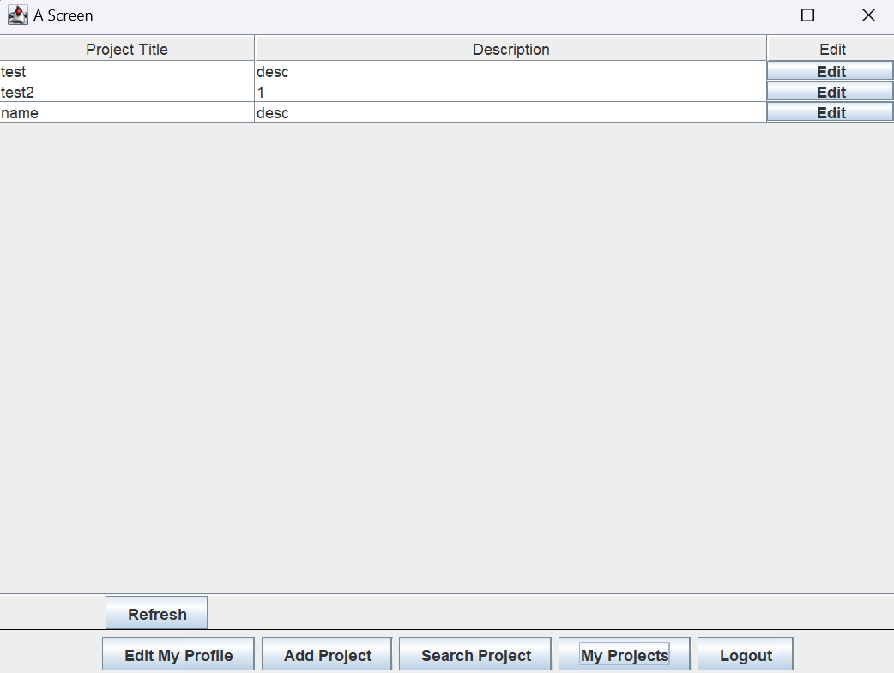
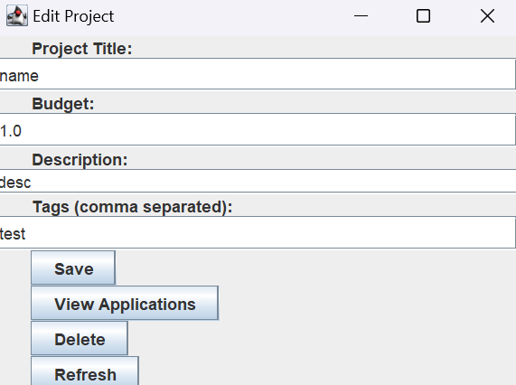

# Group Formation System

This repository contains code for our groups CSC207 project, a Project and User Management system. Through our program, a user can
manage both the user and projects.
1. __User__ is which has a username, userid, and tags that assist in matching relevant projects.
2. __Project__ has a projectId, title, description, budget, and tags.


# Instructions

Clone the ```main``` branch of the code base. Invoke ```Main.java``` in the ```src/main/java``` directory.

### Put in the API key


We have provided the following GIFs, which demonstrate each use case, for the user's convenience.

### Create User

A user can be created with a first name, last name, email, password, and desired compensation.
Note that there is a basic check of whether the email is in a valid format and the password needs to be at least 5 characters long.


### Login

The user can login using the email and password provided during creation.


### Editing user information

All information except user email can be edited here.
The save button needs to be pressed after editing in order to save the changes.


### Logout

The user can logout using this button.


### Create Project

The user can create a project by providing a name, a budget, some description of the project, and some tags.
The user that created the project will be the owner.


### View Projects

The user can view their projects, including those they own and those they joined.



### Edit Projects

The user can view details and applications of their projects, however only the owner can edit and delete projects.



### Search Projects

The user can search projects by typing in keywords or descriptions of projects they want to find. 
They can also apply to projects by providing a description and a pdf file.
