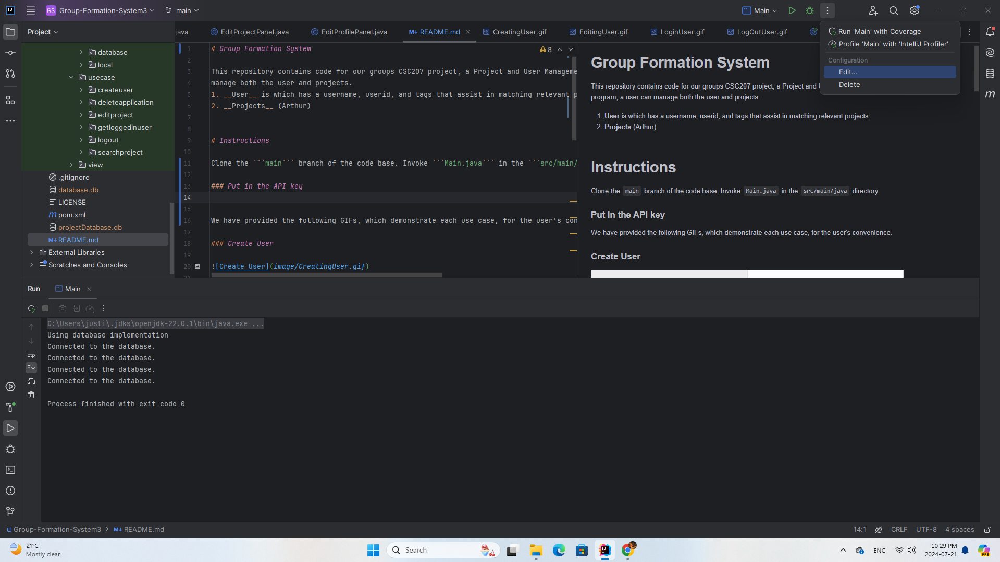
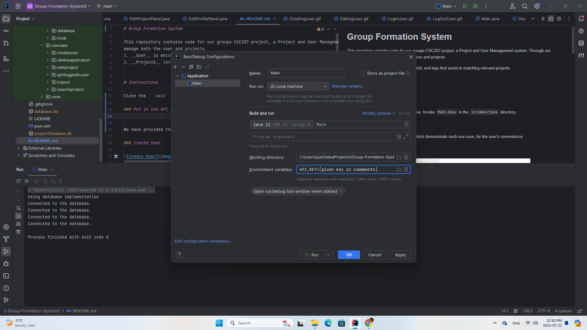
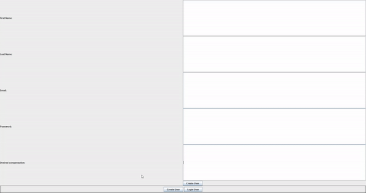
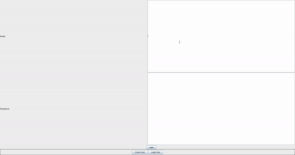
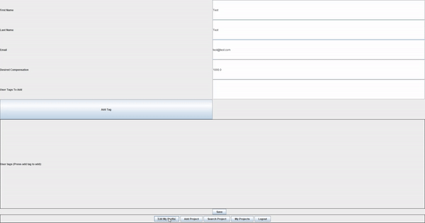
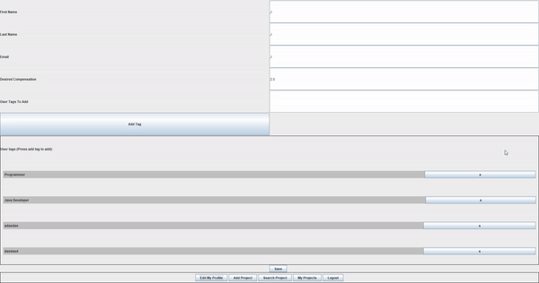

# Group Formation System

This repository contains code for our groups CSC207 project, a Project and User Management system. Through our program, a user can
manage both the user and projects.
1. __User__ is which has a username, userid, and tags that assist in matching relevant projects.
2. __Project__ has a projectId, title, description, budget, and tags.


# Instructions

Clone the ```main``` branch of the code base. Invoke ```Main.java``` in the ```src/main/java``` directory.

### Put in the API key





We have provided the following GIFs, which demonstrate each use case, for the user's convenience.

### Create User



### Login User



### EditingUser



### LogOutUser



### Delete Event


### Delete Task


### Complete Task


### Clear All

